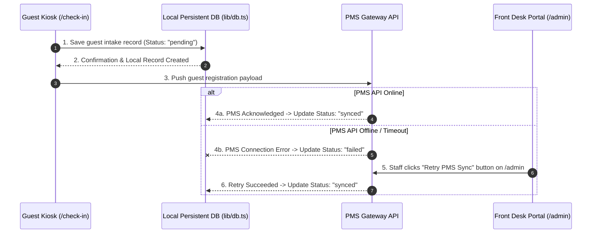

# Next.js Digital Hotel Guest Registration Architecture Walkthrough

The enterprise architecture for the Digital Hotel Guest Registration system has been fully implemented, split into secure separate routes, protected with staff authentication, backed by a persistent local database, and equipped with a resilient PMS sync retry flow.

---

## 1. Routing Strategy & Security Model

- **Guest View (Tablet Kiosk Mode)**: [http://localhost:3000/check-in](http://localhost:3000/check-in)
  - Dedicated self-service intake form locked to the tablet viewport.
  - No administrative tabs or navigation links.
  - Automatically resets after every successful check-in registration to protect guest privacy.
- **Front Desk Staff Portal (Protected Admin)**: [http://localhost:3000/admin](http://localhost:3000/admin)
  - Secured via Next.js Middleware (`middleware.ts`).
  - Unauthenticated visitors are automatically redirected to [/login](http://localhost:3000/login).
- **Staff Login Page**: [http://localhost:3000/login](http://localhost:3000/login)
  - **Username**: `admin`
  - **Password**: `admin123`
- **Root URL Redirect**: Accessing `http://localhost:3000/` automatically redirects guests to `/check-in`.

---

## 2. Resilient Data Flow & PMS Sync Strategy (`lib/db.ts`)

### Key Security & Resiliency Features

1. **Local Persistent Storage First (`lib/db.ts`)**:
   - Every guest registration submitted on `/check-in` is stored instantly in local persistent storage (`registrations_db.json`) before calling the PMS API.
   - If the PMS API is down or undergoes maintenance, **zero guest data is lost**.

2. **Manual & Automated Retry Mechanism**:
   - Failed or pending records appear on the Front Desk Dashboard (`/admin`) marked with a high-contrast **"Failed Sync"** status badge.
   - Staff can click **"Retry PMS Sync"** on any failed card to manually trigger a re-push to the PMS Gateway at any time.
